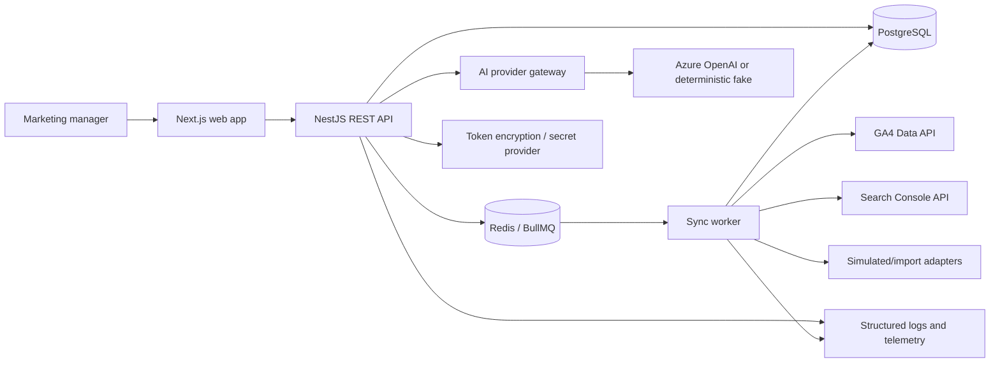
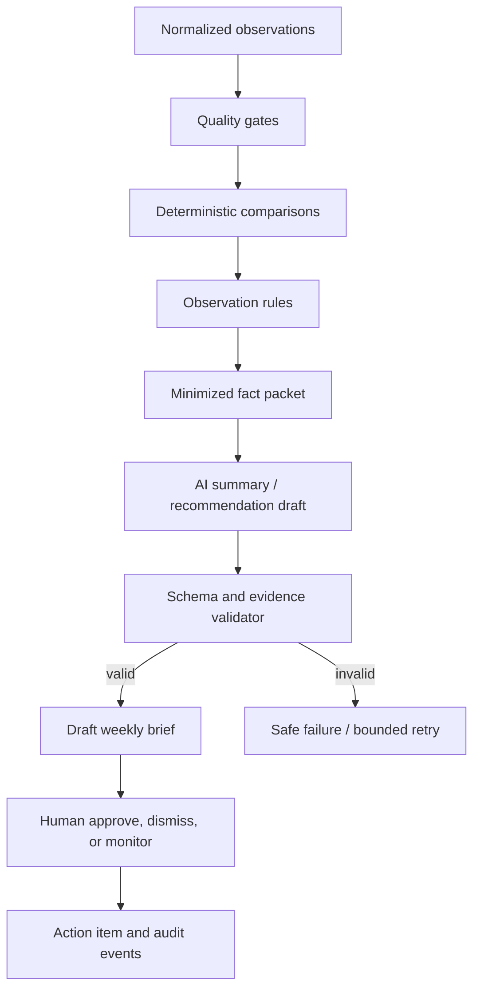

# ReachOps Portfolio Architecture Blueprint

**Status:** Implementation baseline  
**Scope:** Production-quality portfolio demonstration, not commercial SaaS  
**Product scope authority:** [ReachOps Discovery Report](../discovery/reachops-discovery-report.md)  
**Synthetic customer authority:** [Summit & Sage demo specification](../demo/summit-and-sage-synthetic-customer.md)

## 1. Architectural objective

Build one coherent, five-minute demonstrable workflow:

```text
connect or inspect sources → synchronize → normalize → detect facts
→ generate evidence-linked weekly brief → human approves a recommendation
→ assign action → inspect audit history
```

The architecture must make trust visible. Data provenance, connection status, deterministic calculations, AI boundaries, approval state, and audit history are product features, not backend-only concerns.

## 2. Repository conversion decision

The current repository already contains useful platform foundations:

- pnpm/Turborepo TypeScript monorepo;
- Next.js 15 web application;
- NestJS 11 REST API and OpenAPI tooling;
- PostgreSQL, Prisma migrations, and tenant-scoped records;
- an AI provider abstraction with deterministic fake mode;
- append-oriented audit events;
- backend/frontend test foundations;
- Docker Compose and deterministic demo scripts.

It also contains a different domain—ProcessForge knowledge management—which must not coexist in the visible ReachOps product. The conversion should preserve proven patterns, not domain entities or user journeys.

### Conversion rules

1. Tag or otherwise preserve the last ProcessForge state before destructive domain removal when implementation begins.
2. Replace product naming, package names, environment names, demo scripts, API modules, routes, and database schema through reviewable commits.
3. Do not leave dormant ProcessForge navigation or knowledge endpoints in the ReachOps build.
4. Preserve and adapt reusable patterns: service authorization, migrations, AI provider contracts, audit append behavior, error mapping, test utilities, and seed safety.
5. Make the ReachOps documentation under `docs/` authoritative for the converted project. Retire or archive contradictory ProcessForge planning documents in the conversion milestone.
6. Do not perform the conversion as a single “rewrite” commit. Establish a branded shell, then replace vertical slices sequentially.

## 3. Target topology



### Runtime units

- `apps/web` — Next.js UI and server-side session boundary.
- `apps/api` — NestJS modular monolith and REST/OpenAPI contract.
- `apps/worker` — BullMQ consumers for synchronization and weekly brief jobs.
- `packages/database` — canonical Prisma schema/client and migrations.
- `packages/contracts` — request/response and structured AI schemas shared by web/API/worker.
- `packages/ai` — thin provider abstraction, prompt builders, output validation, deterministic fake provider.
- `packages/integrations` — provider-neutral adapter contracts and Google/simulated implementations.
- `packages/ui` — ReachOps design tokens and reusable accessible components only when duplication warrants extraction.

## 4. Authentication and OAuth

Application identity and marketing-data authorization are separate trust decisions.

### Application sign-in

- Use Google OpenID Connect for the deployed portfolio sign-in, limited to `openid email profile`.
- Establish an application session; the NestJS API validates the signed token/session assertion and independently resolves the user/workspace/role.
- Retain a clearly marked development/demo identity mode only for local and controlled portfolio environments. It must be impossible to enable accidentally in production.
- All authorization remains server-side. Hidden navigation is never the enforcement boundary.

### Google data connection

- Use a separate OAuth authorization-code flow with PKCE/state and incremental consent.
- Request only GA4 read and Search Console read scopes required by the adapters.
- Let the user select an authorized GA4 property and Search Console property after consent.
- Store access/refresh tokens only in the server-side credential vault abstraction.
- Encrypt refresh tokens at the application layer before persistence; use Azure Key Vault/KMS-backed keys in the deployed environment.
- Never return tokens to the browser or log authorization codes, tokens, or full provider payloads.
- Support disconnect, revocation, expired-grant recovery, and scope/resource display.

The five-minute demonstration should normally use a pre-authorized, non-sensitive portfolio account. The Connections screen proves the flow and exposes scopes, resource selections, last sync, and disconnect behavior without spending interview time completing consent.

## 5. Domain model

### Identity and workspace

- `Workspace` — the tenant boundary; one Summit & Sage demo workspace.
- `User` — authenticated person or service actor.
- `Membership` — user role in workspace: `MANAGER`, `CONTRIBUTOR`, `EXECUTIVE_VIEWER`.

### Connections and ingestion

- `DataSourceConnection` — provider, mode (`LIVE`, `SIMULATED`, `IMPORTED`), health, scopes, selected resources, last success.
- `OAuthCredential` — encrypted token material and expiry metadata; never exposed through normal DTOs.
- `SyncRun` — requested/started/completed timestamps, status, attempt, correlation ID, counts, error code, safe error summary.
- `SyncCursor` — provider/resource checkpoint and overlap window.
- `ImportBatch` — file hash, schema version, row counts, uploader and validation result.

### Measurement

- `MetricDefinition` — canonical family, native metric name, unit, aggregation behavior, description, comparability rules.
- `MetricObservation` — workspace, connection, resource, metric, date/grain, dimensions, value, retrieval time, sync run, quality flags.
- `ContentItem` — source-native page/query/post identity used for dimension references.
- `BusinessGoal` — target, metric and timeframe.
- `BusinessAnnotation` — campaigns, deployments, outages, weather/context supplied by a human.

Normalize structure, not meaning. Do not create a universal reach score. Native definitions and source lineage remain available at every evidence view.

### Analysis and workflow

- `ObservationCandidate` — deterministic rule output with severity, confidence inputs, rule version and status.
- `EvidenceLink` — immutable reference from observation/recommendation/brief claim to metric observations or annotations.
- `WeeklyBrief` — reporting window, generation state, deterministic fact-packet hash, model/template version, human approval state.
- `Recommendation` — AI- or rule-proposed next step, rationale, evidence set, confidence, status (`PROPOSED`, `APPROVED`, `DISMISSED`, `MONITORING`).
- `ActionItem` — approved work, owner, due date, expected signal, review date and state.
- `ActionEvent` — append-only action transitions and comments.
- `AiGeneration` — purpose, provider/model, template version, input fact IDs/hash, validation result, token/latency metadata, safe failure.
- `AuditEvent` — append-only security and business events across connections, sync, briefs, decisions and actions.

### Data invariants

1. Every business record is workspace-scoped.
2. Every metric has a source connection, native definition, reporting grain and retrieval lineage.
3. A recommendation cannot be approved without evidence.
4. An action is created only from a human-approved recommendation or explicit human entry.
5. AI output never mutates metrics, permissions, connections or external systems.
6. Audit and action events are append-only through application services.
7. Simulated/imported status propagates to every derived observation, recommendation and brief.
8. A required stale/failed source prevents an unqualified “complete” brief; the UI reports partial coverage.

## 6. Module boundaries

| Module            | Owns                                                          | Does not own                      |
| ----------------- | ------------------------------------------------------------- | --------------------------------- |
| `auth`            | Sessions, current actor, workspace membership                 | Google Analytics tokens           |
| `connections`     | OAuth flow, resource selection, encrypted credentials, health | Metric calculations               |
| `sync`            | Job requests, cursors, retries, run history                   | UI interpretation                 |
| `integrations`    | Provider API calls and native-to-contract mapping             | Database/business workflow        |
| `metrics`         | Definitions, observations, comparison queries, quality        | Narrative generation              |
| `insights`        | Deterministic rules and evidence construction                 | Model-authored facts              |
| `briefings`       | Fact packet, AI generation, validation, brief lifecycle       | External publishing               |
| `recommendations` | Proposal and human decision state                             | Action execution without approval |
| `actions`         | Assignment, due/review dates, state transitions               | Claiming causal business results  |
| `audit`           | Append-only event capture and authorized query                | Editing history                   |
| `demo`            | Versioned synthetic seed/reset and disclosure metadata        | Production startup side effects   |

## 7. Integration adapter contract

Each adapter implements capabilities rather than pretending feature parity:

```ts
interface SourceAdapter {
  provider: 'GA4' | 'SEARCH_CONSOLE' | 'GBP_SIMULATED' | 'LINKEDIN_IMPORT';
  mode: 'LIVE' | 'SIMULATED' | 'IMPORTED';
  listResources(context: ConnectionContext): Promise<SourceResource[]>;
  validateConnection(context: ConnectionContext): Promise<ConnectionHealth>;
  sync(request: SyncRequest): Promise<NormalizedBatch>;
}
```

`NormalizedBatch` contains metric definitions, observations, content references, provider cursor, coverage, and safe warnings. The adapter never writes to the database directly. The sync application service validates and persists the batch transactionally and idempotently.

### Idempotency and scheduling

- Unique observation identity: workspace + connection + resource + native metric + grain/date + dimension hash.
- Sync jobs use stable idempotency keys per connection/window.
- Daily sync overlaps at least the last three days to capture late revisions.
- Retries use bounded exponential backoff with provider-specific handling.
- One active sync per connection is protected by a distributed lock.
- Dead-letter/final failure is visible on Connections and Activity screens.
- The schedule is visible: last attempt, last success, next planned run.

## 8. Deterministic and AI pipeline



### Fact packet contract

The model receives only:

- reporting window and timezone;
- business goals and relevant human annotations;
- deterministic observation IDs and exact display values;
- data-quality/coverage flags;
- metric definitions needed for explanation;
- allowed recommendation categories.

The model returns structured JSON containing summary paragraphs, claim-level evidence IDs, recommendations, confidence, caveats and prohibited-causality confirmation. Validation rejects unknown IDs, numbers absent from the packet, missing caveats for partial data, and unsupported recommendation types.

The deterministic fake provider must produce a credible, visibly labeled result from the same contract. There is no silent fallback from configured live AI to fake AI.

## 9. REST surface

Representative `/api/v1` resources:

- `GET /me`, `GET /workspaces/:id`
- `GET|POST /connections`, `GET /connections/:id/resources`
- `GET /oauth/google/start`, `GET /oauth/google/callback`, `POST /connections/:id/disconnect`
- `POST /connections/:id/sync`, `GET /sync-runs`
- `GET /metrics/summary`, `GET /metrics/evidence/:evidenceId`
- `GET /weekly-reviews/current`, `POST /weekly-reviews/:id/generate`
- `POST /recommendations/:id/approve|dismiss|monitor`
- `GET|POST /actions`, `PATCH /actions/:id/status`
- `GET /audit-events`
- `POST /demo/reset` only in explicitly enabled demo environments and authorized for a demo administrator

All write endpoints use validation, authorization, idempotency where relevant, stable domain error codes, and audit events.

## 10. Information architecture and UI standard

### Primary navigation

1. **Overview** — executive health, current reporting window, top priorities, goal progress and source coverage.
2. **Weekly Review** — narrative brief, deterministic observations, evidence drawer, recommendations and approval controls.
3. **Actions** — owned work grouped by due/status with evidence and outcome-review date.
4. **Connections** — scopes, resource, mode, health, last/next sync, retry and disconnect.
5. **Activity** — human, system and AI audit timeline with filters.

An About/Demo panel provides architecture, synthetic-data disclosure, dataset version, AI disclosure and source-mode explanation without competing with the primary flow.

### Executive-quality UI rules

- Use the Summit & Sage brand as workspace context within a neutral ReachOps shell.
- Keep a persistent `Synthetic workspace` disclosure and source-mode chips.
- Lead Overview with one sentence: “Demand is up; AC repair conversion needs attention.”
- Limit the initial screen to four goal/KPI cards, three priorities and one concise trend visualization.
- Use color to communicate state, never as the only signal. Copper is attention, not generic decoration.
- Put metric definition, source, retrieval time and quality in an evidence side panel rather than a tooltip.
- Display percentage-point change correctly for rates and “lower is better” for average position.
- Distinguish deterministic observation, AI interpretation and human decision through labels and iconography.
- Keep charts sparse: direct labels, comparison band, annotation markers, accessible table alternative.
- Use skeletons for expected loading, targeted empty/error states, and no layout shift in the demo path.
- Approval is a considered action: review evidence, select owner/due date, then confirm. Avoid celebratory animation for routine governance.
- Make the current action and its evidence link visible in the same viewport during the flagship demo.

## 11. Five-minute demonstration contract

|      Time | Screen              | Story                                                                                                       | Proof                                                                             |
| --------: | ------------------- | ----------------------------------------------------------------------------------------------------------- | --------------------------------------------------------------------------------- |
| 0:00–0:35 | Overview            | Summit & Sage is a clearly synthetic SMB; demand is up but one issue needs attention                        | Polished brand context, goals, source modes, current week                         |
| 0:35–1:20 | Connections         | GA4 and Search Console are live-capable OAuth connections; other sources are simulated/imported and labeled | Scopes, resource selection, sync health, last/next run                            |
| 1:20–2:35 | Weekly Review       | Traffic increased, but AC repair booking rate fell                                                          | Deterministic numbers, evidence IDs, definitions, annotation without causal claim |
| 2:35–3:30 | AI brief            | AI explains the facts and proposes investigating the mobile booking path                                    | Structured grounded output, evidence links, uncertainty, model metadata           |
| 3:30–4:20 | Approval and action | Maya approves, assigns Jonah and sets a review date                                                         | Human control, state transition, owner/due date                                   |
| 4:20–4:50 | Activity            | Sync, AI draft, approval and assignment are traceable                                                       | Audit timeline and actor separation                                               |
| 4:50–5:00 | About               | Architecture and disclosure close the story                                                                 | Real vs simulated sources, AI-assisted development statement                      |

The demo must also have a 90-second fallback path: Overview → open top priority → evidence → approve → Activity.

## 12. Security baseline

- Server-side workspace and role authorization for every route/service.
- Least-privilege Google scopes and separate identity/data consent.
- OAuth state/PKCE, exact redirect allowlist and secure session cookies.
- Encrypted refresh tokens, redacted structured logs and secrets outside Git.
- Input and structured AI output validation.
- Prompt construction treats reviews/imported text as untrusted data.
- AI service has no external write tools.
- Rate limits on auth, generation, sync triggers and demo reset.
- Dependency/container scanning in CI and secret scanning.
- Content Security Policy, Helmet and secure headers.
- Audit events for connection, sync, AI, decision, assignment and permission activity.
- Synthetic data only in public deployment; real authorized analytics must be non-sensitive and documented.

## 13. Deployment recommendation

Use the repository’s Azure direction because it supports the portfolio story consistently:

- Azure Container Apps: web, API and worker;
- Azure Database for PostgreSQL;
- Azure Cache for Redis;
- Azure Key Vault with managed identity;
- Azure OpenAI through the existing provider boundary;
- Application Insights for request, job and dependency telemetry;
- Bicep for reproducible infrastructure;
- GitHub Actions for validation and controlled deployment.

For a portfolio environment, scale-to-zero/cost controls and a deterministic seeded fallback are more important than multi-region design. Publish no uptime, customer, or performance claims that have not been measured.

## 14. Architecture decision triggers

Do not introduce microservices, a warehouse, Kafka, Kubernetes, a vector database, GraphQL, or multiple production AI providers for this portfolio build. Reconsider only if a measured constraint in synchronization volume, analytical query performance, deployment isolation, or provider capability demands it.
