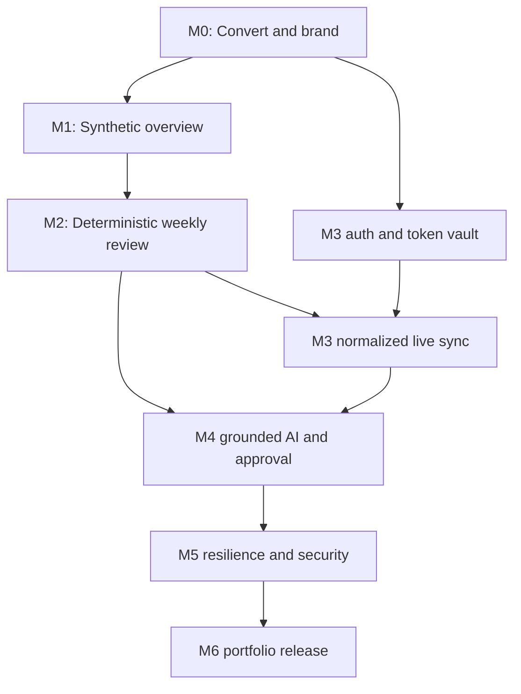

# ReachOps Portfolio Implementation Roadmap

**Objective:** Convert the existing repository into a polished, production-quality portfolio application that tells the ReachOps story in five minutes.  
**Product boundary:** Implement only the narrowed Weekly Reach Review defined by discovery. Do not expand into scheduling, social inbox, marketing automation, general BI, or commercial SaaS administration.  
**Detailed backlog:** [GitHub Issue Register](github-issue-register.md)  
**Architecture baseline:** [ReachOps Architecture Blueprint](reachops-architecture-blueprint.md)  
**Demo data authority:** [Summit & Sage Synthetic Customer](../demo/summit-and-sage-synthetic-customer.md)

## 1. Delivery principles

1. **Demo vertical slices before platform breadth.** Each milestone ends in a visible scenario that can be shown even if all later work stops.
2. **One coherent customer story.** Summit & Sage is the only MVP workspace. Multi-tenant boundaries are implemented for engineering evidence, not exposed as commercial account administration.
3. **Real where meaningful, simulated where honest.** GA4 and Search Console are live-capable. GBP, LinkedIn and Meta remain explicitly simulated/imported.
4. **Facts before AI.** Deterministic calculations and evidence work before narrative generation is added.
5. **Human decisions own action.** AI proposes; people approve, assign and review.
6. **Trust is visible.** Source mode, freshness, scope, quality, evidence, model mode and audit history appear in the UI.
7. **No dead milestones.** Infrastructure is introduced when a visible feature needs it, not as speculative scaffolding.
8. **One issue, one reviewable outcome.** Prefer a small vertical change with tests and UI proof over broad refactors.

## 2. GitHub milestones

| Order | GitHub milestone                           | Issues      | Visible milestone outcome                                                                   | Exit criteria                                                                                                           |
| ----: | ------------------------------------------ | ----------- | ------------------------------------------------------------------------------------------- | ----------------------------------------------------------------------------------------------------------------------- |
|    M0 | ReachOps Foundation and Branded Shell      | RCH-001–005 | Branded ReachOps shell with Summit & Sage disclosure and final navigation                   | Independent ReachOps identity; fresh build and tests pass; shell is presentable                                         |
|    M1 | Synthetic Executive Overview               | RCH-006–011 | Populated, polished executive view with 13-month history, goals, campaigns and source modes | Seed/reset is deterministic; overview reproduces synthetic specification; loading/error states work                     |
|    M2 | Deterministic Weekly Review                | RCH-012–018 | AC repair divergence → evidence → human decision → assigned action → activity               | Flagship values reproduce exactly; lifecycle and audit authorization tests pass; no AI required                         |
|    M3 | Live Google Connections and Scheduled Sync | RCH-019–025 | Google OIDC/data OAuth, GA4/GSC adapters, worker scheduling, connection health and recovery | At least one real authorized connection works in a safe environment; fixture fallback remains labeled and deterministic |
|    M4 | Trustworthy AI to Approved Action          | RCH-026–031 | Evidence-linked AI brief → manager approval → human-owned action                            | Evaluation suite rejects unsupported claims; every AI number links to evidence; no autonomous write path exists         |
|    M5 | Operational Trust and Resilience           | RCH-032–035 | Graceful stale/rate-limit/AI failure demo plus traceable operations and export              | Stable errors, observability, security tests and degradation behavior pass                                              |
|    M6 | Five-Minute Portfolio Release              | RCH-036–038 | Polished, deployed, repeatable five-minute story with 90-second fallback                    | Three timed rehearsals pass; CI/deployment/runbook/README are complete; no unsupported claims                           |

Do not open all issues as active work. Create M0 and M1 immediately; create later milestones in GitHub for visibility, but move their issues from this register into GitHub only as the prior milestone approaches completion. This keeps the board credible and prevents a 38-item false-progress queue.

## 3. Dependency order



### Critical path

```text
RCH-001 → 002 → 003 → 006 → 007 → 008 → 010 → 011
→ 012 → 013 → 014 → 015 → 016 → 017 → 018
→ 019/020 → 021 → 022/023 → 024 → 025
→ 026 → 027 → 028 → 029 → 030 → 031
→ 032/033 → 034 → 035 → 036 → 037 → 038
```

Parallel work is safe only where dependencies permit, for example RCH-004 after RCH-002 while RCH-003 proceeds, GA4 and GSC adapters after the OAuth/contract work, or observability while recovery-state UI is built. Keep no more than two feature issues in progress to protect integration quality.

## 4. Milestone execution plan

### M0 — ReachOps Foundation and Branded Shell

Establish independent-repository governance under ADR-002, create ReachOps runtime/package identity, introduce the ReachOps schema foundation, and build the visible shell. Do not copy ProcessForge’s knowledge schema or runtime into ReachOps merely because historical code exists.

**Demo improvement:** The repository immediately looks intentional and interview-ready rather than like a renamed internal tool.

**Review gate:** A reviewer can run the app, see only ReachOps concepts, navigate the five future areas, and locate synthetic-data disclosure.

### M1 — Synthetic Executive Overview

Build the normalized measurement foundation through one complete synthetic customer, not abstract connector breadth. Seed exact values from the customer specification and render the management story with definitions and provenance.

**Demo improvement:** Hiring managers see a believable business, goals, seasonality, campaign context and executive UI—not placeholder cards.

**Review gate:** Seed twice, reset once, and verify exact flagship/history values without duplicates or data outside the demo workspace.

### M2 — Deterministic Weekly Review

Implement arithmetic, quality gates, observation rules, evidence, human decision state, actions and audit. This milestone intentionally proves the product works without AI.

**Demo improvement:** ReachOps performs its core job: it finds the meaningful AC repair conversion divergence and turns evidence into accountable work.

**Review gate:** Complete the deterministic demo from Overview through Activity with the AI provider disabled.

### M3 — Live Google Connections and Scheduled Sync

Add production-capable identity, encrypted data OAuth, GA4/GSC adapters, BullMQ worker orchestration and connection health UI. Retain seeded Google fixtures so the public demo is reliable and real authorization remains optional and truthful.

**Demo improvement:** The interviewer can see authentic OAuth, resource selection, scheduled integration operations, and failure recovery.

**Review gate:** Run one live authorized sync and one seeded failure scenario; show that source mode and lineage remain correct in both.

### M4 — Trustworthy AI to Approved Action

Create a minimized fact packet, structured weekly-output schema, validators, adversarial evaluation, generation lifecycle and evidence-linked narrative UI. Connect AI recommendation to the existing human workflow.

**Demo improvement:** ReachOps demonstrates modern AI integration with visible grounding and governance rather than a generic chatbot.

**Review gate:** The AI may vary in prose but must reproduce supported values/evidence, preserve uncertainty, and fail safely on evaluation traps.

### M5 — Operational Trust and Resilience

Standardize errors, add traceable observability, harden auth/OAuth/tenant/AI boundaries, expose action review and create a concise export.

**Demo improvement:** A controlled failure becomes positive portfolio evidence: the product explains what failed, what remains trustworthy, and how to recover.

**Review gate:** Demonstrate expired grant, rate limit/partial sync and AI unavailability without crashes, fabricated output or lost deterministic facts.

### M6 — Five-Minute Portfolio Release

Finish visual/accessibility consistency, automate local/deployed demo operations, run E2E rehearsals, deploy through reproducible infrastructure, and publish the portfolio narrative.

**Demo improvement:** The project becomes independently evaluable and reliably presentable under interview constraints.

**Review gate:** Three consecutive five-minute rehearsals from reset state, plus a 90-second fallback, complete successfully.

## 5. Acceptance hierarchy

Issue acceptance criteria in the register are mandatory. Milestone exit criteria add integration-level proof. The release also uses these product-level acceptance criteria:

### Product

- The first screen communicates what changed and what deserves attention in under 30 seconds.
- The flagship priority is traceable from summary to raw source definition and sync run.
- A recommendation cannot become work without a human decision.
- A viewer can distinguish live, simulated, imported, deterministic, AI-generated and human-approved information.
- No unsupported cross-channel “reach score,” ROI, causality or customer result is shown.

### Architecture

- Frontend, API and worker depend on shared contracts rather than copying DTOs.
- Adapters return normalized batches and never write directly to persistence.
- Business calculations do not depend on model output.
- Every tenant-scoped service is covered by cross-workspace denial tests.
- Scheduled work is idempotent, retryable and observable.

### AI

- Input is a minimized deterministic fact packet.
- Output is schema-validated and evidence-linked.
- Unknown evidence/numbers, prompt injection, missing caveats and unsupported causality fail validation or evaluation.
- Live and fake provider modes are explicit; there is no silent fallback.
- AI cannot approve, change permissions or call external write integrations.

### Operations

- A clean environment can migrate, seed, start, health-check and reset without manual database work.
- Errors are safe, actionable and correlated to redacted logs.
- Real secrets/tokens are absent from Git, browser payloads, fixtures and logs.
- Deployed smoke tests and rollback steps are documented.

## 6. Definition of Ready

An issue is ready when:

- its user/demo outcome is stated;
- all dependencies are closed or explicitly mocked through an approved contract;
- acceptance criteria are testable;
- API/schema/UX decisions that could block implementation are linked;
- synthetic versus real data behavior is specified;
- security and audit implications are identified;
- the proposed commit boundary is smaller than a milestone and reviewable in isolation.

## 7. Definition of Done

An issue is done only when all applicable items are true:

1. Acceptance criteria are satisfied and demonstrated.
2. Server-side authorization and workspace isolation are implemented and tested.
3. Inputs, external responses and structured AI outputs are validated.
4. Success, empty, loading, partial, stale, unauthorized and relevant failure states are handled.
5. Audit events exist for security-sensitive or decision-changing operations.
6. Source mode and synthetic disclosure propagate correctly.
7. Unit/integration/UI/contract/E2E tests appropriate to risk pass.
8. Format, lint, typecheck, test and build pipelines pass.
9. Prisma schema changes include reviewed migrations and fresh-database verification.
10. OpenAPI/contracts and affected architecture/runbook documentation are updated.
11. No secrets, tokens, PII, fabricated access or unsupported outcome claims are introduced.
12. The milestone demo script is updated when the visible journey changes.
13. The change is accessible by keyboard and responsive when it affects UI.
14. The issue can be rolled back without silently corrupting later data.

“Works on the happy path” is not Done for OAuth, sync, AI, approval, actions or audit features.

## 8. Suggested commit boundaries

### General policy

- Use Conventional Commits.
- Prefer one cohesive issue per commit when the change is small.
- For database-backed features, separate the schema/migration from the service/UI only when each commit builds and tests independently.
- Never combine generated formatting churn, package upgrades, domain conversion and a feature in one commit.
- Keep seed changes with the domain behavior they demonstrate, not in an unrelated later “demo data” dump.
- Do not commit secrets, generated local data, screenshots with tokens, or real analytics exports.

### Recommended patterns

| Change                    | Commit boundary                                                                           |
| ------------------------- | ----------------------------------------------------------------------------------------- |
| ADR/documentation         | One `docs(...)` commit                                                                    |
| Package/repository rename | One package/import commit, one configuration/env commit                                   |
| Prisma feature            | `feat(data)` migration/model commit, then service/API commit, then focused tests if large |
| Vertical UI/API slice     | Contract/API first if independently testable; UI and UI tests together                    |
| Adapter                   | Adapter + mapping tests in one commit; worker wiring separately                           |
| AI capability             | Fact/prompt contract, validator/evals, persistence/API, then UI                           |
| Security hardening        | Small controls with their tests; avoid an opaque “security fixes” mega-commit             |
| Deployment                | Infrastructure change separate from portfolio documentation/screenshots                   |

The issue register supplies exact suggested commit subjects. Commits should remain unmade until explicitly authorized under the repository’s Git rules.

## 9. UI improvement priorities

### Priority 0 — Required for the first visible milestone

- Replace the narrow generic status shell with an executive application frame and clear page hierarchy.
- Add ReachOps wordmark, Summit & Sage workspace identity and persistent synthetic badge.
- Use a warm neutral background, restrained evergreen/sage palette and copper only for attention/primary actions.
- Establish consistent typography, spacing, focus ring, card, button, badge, dialog and error patterns.
- Make the primary action visible in every empty/preview state.

### Priority 1 — Core demonstration polish

- Add management headline and source-coverage strip above KPI cards.
- Use a sparse annotated trend chart plus table alternative, not a dashboard grid of small charts.
- Create an evidence drawer with definition, source, dates, raw values, calculation, quality and sync lineage.
- Label `Deterministic observation`, `AI interpretation`, and `Human decision` directly.
- Design approval as a focused review step with owner/due/review date in one dialog.
- Use a chronological Activity timeline to make architecture and governance visible without explaining code.

### Priority 2 — Release polish

- Create original Summit & Sage logo and restrained campaign annotations.
- Add print-friendly brief, screenshots and a concise architecture/About panel.
- Add skeletons and transition polish while respecting reduced-motion preferences.
- Add visual regression coverage for interview viewport sizes.
- Ensure every failure screen has a recovery action and a “what data is still trustworthy” statement.

### Avoid

- generic admin template aesthetics;
- crowded KPI walls;
- decorative gradients and animations that distract from evidence;
- red/green-only meaning;
- chatbot-first UI;
- universal engagement/reach scores;
- faux real-time counters on daily data;
- auto-publish controls or simulated “success” notifications for external writes.

## 10. Portfolio evidence map

| Story claim                   | Repository evidence                                                        |
| ----------------------------- | -------------------------------------------------------------------------- |
| Identified a business problem | Discovery report, persona and five-minute workflow                         |
| Researched constraints        | Dated source register and API feasibility matrix                           |
| Designed architecture         | Blueprint, ADRs, domain invariants and threat model                        |
| Integrated real APIs          | Google OAuth, GA4/GSC adapters, contract tests and sync history            |
| Normalized multiple sources   | Metric catalog, adapter contract, lineage and source modes                 |
| Used AI appropriately         | Fact packet, schema, validator, adversarial evals and fake/live separation |
| Implemented controls          | Human approval, roles, encrypted tokens, audit and safe errors             |
| Built an operating workflow   | Observation → recommendation → decision → action → review                  |
| Delivered a usable product    | Executive UI, E2E demo, deployment, runbook and accessibility evidence     |

## 11. Scope control and stop conditions

Do not add a connector, role, dashboard, AI feature or external write action unless it improves the five-minute story and has a specific issue with evidence. Defer:

- social publishing/scheduling;
- review replies;
- social inbox/listening;
- ad management or attribution;
- arbitrary dashboard/report builders;
- agency white labeling/client billing;
- multi-region/microservice architecture;
- unrestricted chat over marketing data;
- real GBP, Meta or LinkedIn dependencies without documented approval.

If live Google access is delayed, continue with contract-tested fixtures and the same connection UI, clearly labeled. The release may still proceed as a portfolio demo, but the README and UI must state which adapters were actually exercised live.

## 12. Immediate next action

Begin with RCH-001 only: record the conversion ADR and reconcile the repository’s existing ProcessForge-specific governance before changing runtime code. Then execute M0 sequentially. Do not start Google OAuth or AI work until the synthetic deterministic vertical slice is demonstrable.
